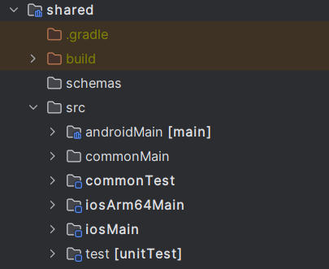
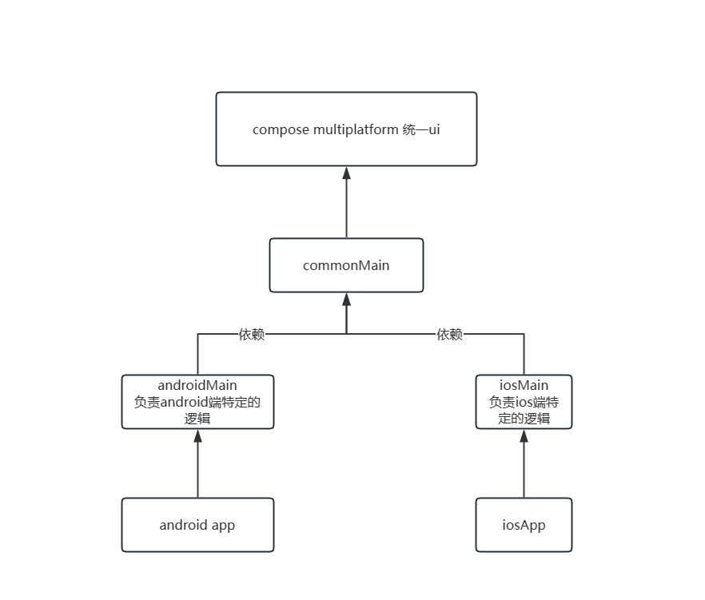
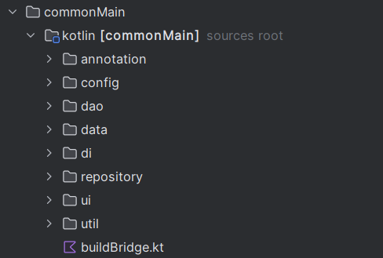
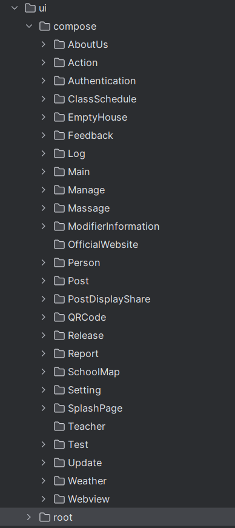

# 开发者指南


## Kotlin Multiplatform

[Get started with Kotlin Multiplatform | Kotlin Multiplatform Development Documentation (jetbrains.com)](https://www.jetbrains.com/help/kotlin-multiplatform-dev/get-started.html)

## Compose Multiplatform

[Compose Multiplatform 入门 — 教程 |Kotlin 多平台开发文档 (jetbrains.com)](https://www.jetbrains.com/help/kotlin-multiplatform-dev/compose-multiplatform-getting-started.html)

## 项目结构






```
为了保证可维护性，项目将最大限度的减少ios端的代码，尽量使用跨平台库或逻辑
```



- **config** 部分参数设置
- **dao** 与数据库 key_value 的交互
- **data** 负责依赖注入网络请求序列化的类
- **di** 负责依赖注入
- **repository** 仓库层
- **ui** 负责ui编写
- 
  - **compse** 该目录下的每个文件夹都代表一个功能，一个主界面 每个文件夹包括ui和viewModel
- **root** 根ui
- **buildBridge** 负责逻辑的特别平台特别实现
- **util** 工具类
- 

## 架构

### 

### 仓库层

仓库层包含大部分的网络逻辑和数据逻辑，所有的网络逻辑必须用flow来包装，来供viewModel使用，

### ViewModel

viewModel处理大部分的逻辑，并为ui提供了网络访问能力，它时仓库层和ui层的桥梁，同时它应存储网络请求的状态，来通知ui更新
其中的网络状态应使用flow 网络请求的状态应该禁止ui直接更改，而是依赖viewModel的内部函数来完成，ui仅仅只有监听的权力

### UI
主要采用voyager，ui应时刻考虑自适应的屏幕大小，voyager类的参数要特别关注，因为voyager可能为其序列化，请用注解标记他们跳过序列化
ui应主要负责ui的绘画而将逻辑委托给viewModel层，ui应只保留非常重要的参数，以便他们可以在任何地方重新使用

#### 沉浸式效果
对于的任何继承voyager 的screen 或 tab 应该有parentPaddingControl 参数，用来传递父布局对于子布局的上下padding控制
子布局对于父布局的约束进行自定义，理论上来说，父布局除了topbar和底部栏外应该给予子布局足够的自定义权限，而子布局对于父布局的约束有履行的义务，但是对于部分特殊布局，子布局仍可以无视父布局的约束，
但这必须用注释来为接下来的开发者提示

## 网络请求

1. 用ktor写出网络请求的逻辑

   ```kotlin
   val response = client.submitForm(
                   url = "/emptyRoom/available",
                   formParameters = parameters {
                       append("Campus",campus)
                       append("Build",build)
                       append("RoomType",roomType)
                       append("Date",date)
                       append("Start",start)
                       append("End",end)
                   }
               ).body<EmptyRoomData>()
   ```

2. flow包装

   ```kotlin
   fun availableEmptyRoom(
           campus:String,
           date:String,
           roomType:String,
           start:String,
           end:String,
           build:String,
       ):Flow<EmptyRoomData>{
           return flow {
               val response = client.submitForm(
                   url = "/emptyRoom/available",
                   formParameters = parameters {
                       append("Campus",campus)
                       append("Build",build)
                       append("RoomType",roomType)
                       append("Date",date)
                       append("Start",start)
                       append("End",end)
                   }
               ).body<EmptyRoomData>()
               emit(response)
           }
       }
   ```

3. viewModel 处理

   ```kotlin
   private val _availableEmptyRoomData = CMutableStateFlow(MutableStateFlow<NetworkResult<Map<String, List<EmptyRoom>?>?>>(NetworkResult.UnSend()))
       val availableEmptyRoomData = _availableEmptyRoomData.asStateFlow()
   
       fun getAvailableEmptyRoomData(
           campus:String,
           date:String,
           roomType:String,
           start:String,
           end:String,
           build:String,
       ){
           viewModelScope.launchInDefault {
               _availableEmptyRoomData.logicIfNotLoading {
                   emptyHouseRepository.availableEmptyRoom(
                       campus = campus,
                       date = date,
                       roomType = roomType,
                       start = start,
                       end = end,
                       build = build,
                   ).actionWithLabel(
                       "availableEmptyRoomData/availableEmptyRoom",
                       catchAction = { label, error ->
                           _availableEmptyRoomData.resetWithLog(label, networkErrorWithLog(error,"获取空教室失败"))
                       },
                       collectAction = { label, data ->
                           _availableEmptyRoomData.resetWithLog(label,data.toNetworkResult())
                       }
                   )
               }
           }
       }
   ```

4. 等待ui调用

   ```kotlin
   emptyHouseVoyagerViewModel.getAvailableEmptyRoomData(
                                     campus = selectCampus.value,
                                     date = dateForSend,
                                     roomType = "普通教室",
                                     start = startClass.value.toString(),
                                     end = endClass.value.toString(),
                                     build = buildForSend
                                 )
   ```

5. 注：大部分的网络请求都要设置一个state，类型为 NetworkResult接口，NetworkResult有四个实现 Success，Loading，Error，UnSend，根据网络请求结果不同设置不同的值，通过绑定toast或者监听来更新ui

